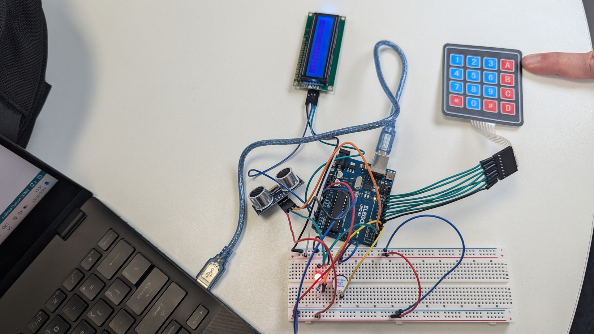
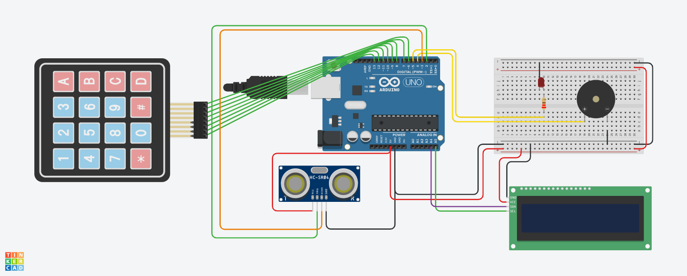

# Home Security Alarm

Keypad-and-sensor alarm on an Arduino Uno: an ultrasonic sensor
watches for movement, an LCD prompts for a passcode, and three wrong
attempts trigger the buzzer.

## How it works
The main loop polls a 4×4 matrix keypad. Digits accumulate into an
entered-password string and echo to a 16×2 I²C LCD; `#` submits.
A correct code toggles the armed state and clears the attempt
counter. An incorrect one shows "Denied", increments the counter,
and at three failures latches the buzzer high.

While armed, the HC-SR04 measures distance each cycle. A reading
past the threshold trips the alarm and prompts for the disarm code —
guarded by a `hasRun` flag so the trigger fires once rather than
every loop iteration.

## Circuit
Prototyped in Tinkercad before building on breadboard:

Arduino Uno · HC-SR04 ultrasonic sensor · 16×2 I²C LCD ·
4×4 matrix keypad · buzzer · LED. Libraries: `Keypad.h`,
`LiquidCrystal_I2C.h`.

## Takeaways
- Edge-triggering matters. Without the `hasRun` guard the alarm
  re-fires on every pass through `loop()` — the first version was
  unusable for exactly this reason.
- `delay()` blocks everything. The five-second alarm hold freezes
  keypad input for its duration; `millis()`-based timing would fix it
  and is the obvious next change.
- The passcode is hardcoded and compared in plaintext. Fine as a
  teaching exercise, not a security design — a real system would need
  a hash and a configurable code.

## Files
- `src/` — Arduino sketch
- `docs/presentation.pdf` — project presentation
- `images/` — Tinkercad circuits and the physical build

---
EE108 Computing for Engineers, Maynooth University, Year 2 (Oct 2024).
Group of 5 — my contribution: slides and password-check logic.
