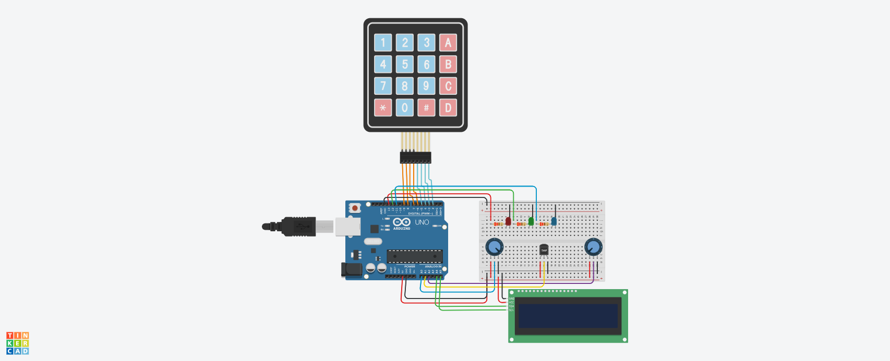

# Room Climate Monitor

Keypad-driven environmental monitor: press 1, 2, or 3 to read
humidity, temperature, or pressure on an LCD, with an RGB LED
showing whether the value is high, normal, or low.

## How it works
The main loop polls a 4×4 keypad. Keys 1–3 dispatch to a display
function; anything else shows "Invalid Key" and re-prompts.

Each display function reads its analog pin, converts the raw
0–1023 value into engineering units, prints it to the LCD, and
calls `setLEDs()` with a status colour based on two thresholds.
`setLEDs()` clears all three pins before lighting one, so the
indicator can't show two colours at once.

Temperature is a real TMP36 reading — raw counts to voltage, then
the sensor's 500 mV offset and 10 mV/°C scale. Humidity and
pressure are potentiometers standing in for sensors the kit didn't
include, mapped to plausible ranges (0–100% and 950–1050 hPa).

## Hardware
Arduino Uno · TMP36 temperature sensor · 2× potentiometer ·
16×2 I²C LCD · 4×4 matrix keypad · red/green/blue LEDs with current-
limiting resistors. Libraries: `Wire.h`, `Adafruit_LiquidCrystal.h`,
`Keypad.h`.

Built and tested in Tinkercad.

## Takeaways
- **`map()` is integer arithmetic.** Assigning its result to a
  `float` doesn't recover precision — humidity and pressure are
  whole numbers displayed with two meaningless decimal places.
  Float maths before the assignment would fix it.
- **Blocking delays cost responsiveness.** The 2 s hold after each
  reading ignores every keypress in that window. A `millis()`-based
  timer would keep the keypad live.
- **Simulated inputs hide real problems.** A potentiometer gives a
  clean, noise-free, perfectly linear signal. A real humidity sensor
  would need calibration, filtering, and warm-up handling — none of
  which this design accounts for.

## Files
- `src/` — Arduino sketch
- `docs/presentation.pdf` — project presentation
- `images/` — Tinkercad circuit

---
EE108 Computing for Engineers, Maynooth University (Nov 2024).
Group of 5 — my contribution: presentation and code.
