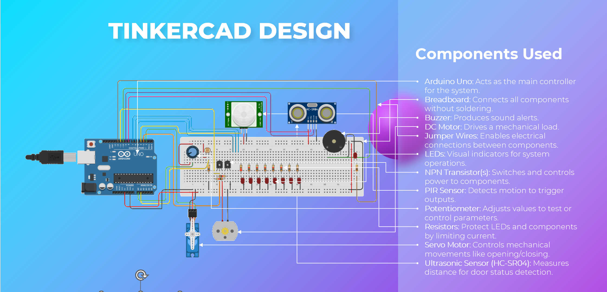

# Smart Home Automation System

Five independent automation subsystems on one Arduino: motion-
triggered lighting, light-triggered curtains, water-level valve
control, sound-toggled lights, and an ultrasonic door alarm.

## Subsystems

| Function | Input | Output | Logic |
|---|---|---|---|
| `lights()` | PIR sensor | 3 LEDs | Motion runs a binary count 0–7 across the LEDs |
| `curtains()` | LDR | DC motor | Timed run up/down, state flag prevents re-triggering |
| `waterSensor()` | Water level (pot) | Servo | Above threshold closes the valve to 0°, below opens to 60° |
| `openedDoor()` | HC-SR04 | Buzzer | Distance past `CLOSED_DOOR` sounds the alarm |
| `soundLights()` | Sound sensor | LED | Sound above threshold toggles light state |

`loop()` calls all five in sequence each pass.

## Hardware
Arduino Uno · PIR sensor · HC-SR04 ultrasonic · LDR · sound sensor ·
potentiometer (water-level stand-in) · servo · DC motor driven
through NPN transistors · buzzer · LEDs.

Prototyped in Tinkercad, then built on breadboard.

## Takeaways
- **Sequential blocking is the architectural flaw.** `lights()`
  alone holds the CPU for four seconds — eight iterations at 500 ms
  — and nothing else runs during that time. The door alarm can be
  several seconds late as a direct result. A `millis()`-based state
  machine, with each subsystem advancing on its own timer, is the
  right structure and would fix every timing problem here at once.
- **Curtain positioning is open-loop.** The motor runs for a fixed
  400 ms with no limit switch or encoder, so actual travel depends
  on load and supply voltage and drifts over repeated cycles.
  Endstops would close the loop.
- **The sound toggle needs real debouncing.** A 200 ms delay isn't
  enough — sustained noise re-triggers the toggle on consecutive
  passes, so the light flickers rather than switching once.
- **Integrating five subsystems is harder than building five.**
  Each works alone; sharing one processor and one loop is where the
  interesting problems started.

## Files
- `src/` — Arduino sketch
- `docs/presentation.pdf` — project presentation
- `images/` — Tinkercad circuit
- [`media/demo.mp4`](media/demo.mp4) — 6 s clip of the system running

---
EE108 Computing for Engineers, Maynooth University (Dec 2024).
Group of 5 — my contribution: hardware assembly and code.
